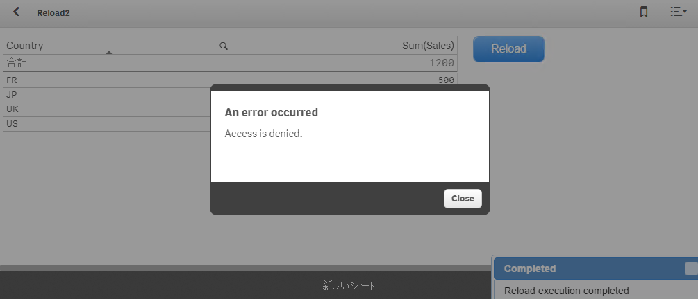

Reload Button for Qlik Sense

## Updated
2015/10/01
- Added "Partial Reload" function
- UI was renewed

2017/05/11
- Fixed to be able to execute reloads on QS3.2 SR3
====
The **Reload Button for Qlik Sense** is an extension which allows you to execute road script by pressing a button placed on a Qlik Sense sheet.

## Demo

## Install
1. Qlik Sense Desktop
Unzip the downloaded zip file into "C:\Users\%USERNAME%\Documents\Qlik\Sense\Extensions\Qlik-Sense-Reload-Button" folder.

2. Qlik Sense Server
Please refer to the following instruction for importing an extension:

	[Import Extension]( http://help.qlik.com/sense/en-US/online/#../Subsystems/ManagementConsole/Content/QMC_Resources_Extensions_AddingExtensions.htm?Highlight=add extension "Import Extension")

Following procedure is experimental:
When you reload a **published** app (not an app in "My work"), the following error occurs. This is because the default security rules of Qlik Sense Server does not allow users to update published apps.

You can allow published apps to be reloaded and saved by adding a security rule on QMC. For example, following security rule allows any users to execute reload button on published apps in "Everyone" stream.

|Name|Setting|
|---|---|
|Resource filter|App*|
|Conditions|(((resource.resourcetype="App" and resource.stream.name="Everyone")  or (resource.resourcetype="App.Object" and resource.app.stream.name="Everyone")))|
|Context|Both in hub and QMC|
|Actions|Update|

**Please be are that it can cause unexpected results, so apply the setting at your own risk!**

## Licence
The software is provided "AS IS" without warranty of any kind. This project is licensed under the terms of the MIT license.

## Author
Masaki Hamano
